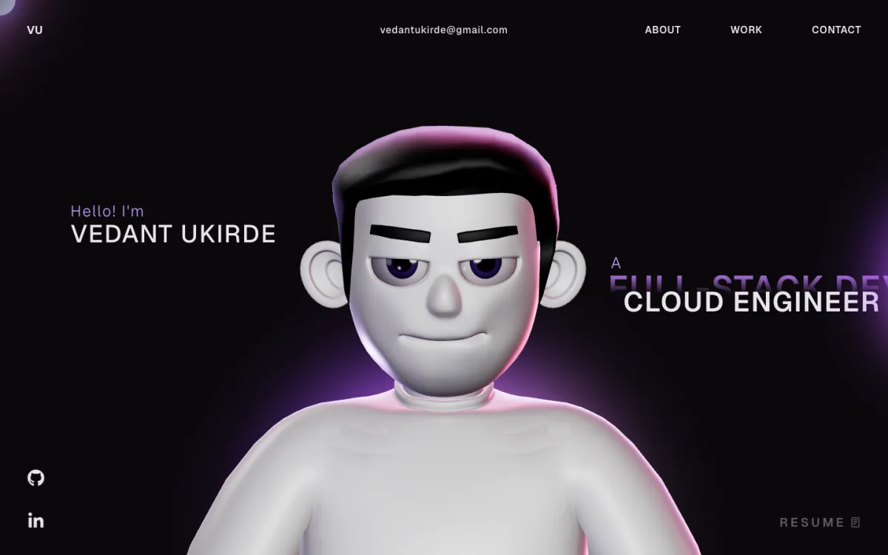

<div align="center">

# Vedant Ukirde — Portfolio

A 3D developer portfolio with an animated character hero, scroll-driven GSAP animations, and a fully data-driven content system.

[](https://react.dev)
[](https://www.typescriptlang.org)
[](https://threejs.org)
[](https://gsap.com)
[](https://vitejs.dev)
[](LICENSE)

</div>

<br>



## About

This is my personal portfolio site — built to actually show off work, not just list it. The hero features a rigged, animated 3D character (Three.js + `@react-three/fiber`) that reacts to cursor movement, and the rest of the page is driven by scroll-triggered GSAP timelines. Every piece of content (bio, work history, skills, projects) is centralized in one typed config file, so the whole site can be re-themed for someone else in minutes.

## Features

- **Interactive 3D hero** — a rigged character model with cursor-tracking head rotation and intro animation, rendered with Three.js and `@react-three/fiber`
- **Scroll-driven animation** — GSAP + ScrollTrigger timelines for section reveals, a pinned horizontal work carousel, and smooth scrolling via Lenis
- **Fully data-driven content** — name, bio, work history, skills, and projects all come from a single [`src/config.ts`](src/config.ts), no content is hardcoded across components
- **Live project cards** — each project card links straight to its real GitHub repository
- **Responsive** — a lighter mobile experience swaps the 3D scene for a static hero image and skips the desktop-only loading sequence
- **Fast** — Vite build with manual chunk splitting (three / react-three / gsap / vendor) and Terser minification

## Tech Stack

| Layer | Technology |
|---|---|
| Framework | React 18, TypeScript, Vite |
| 3D / WebGL | Three.js, `@react-three/fiber`, `@react-three/drei` |
| Animation | GSAP, ScrollTrigger, Lenis (smooth scroll) |
| Routing | React Router |
| Deployment | Vercel |

## Project Structure

```text
portfolio-website-main/
├── public/
│   ├── images/           # Project screenshots, tech icons, profile assets
│   ├── models/           # Encrypted 3D character model + HDR environment
│   ├── resume/           # Downloadable résumé PDF
│   └── draco/            # Draco decoder for compressed 3D geometry
├── src/
│   ├── components/
│   │   ├── Character/    # 3D scene, character rig, lighting, animation
│   │   └── ...            # Navbar, Landing, About, Career, Work, Contact, etc.
│   ├── pages/             # /myworks (full project grid)
│   ├── context/           # Loading state provider
│   ├── config.ts          # Single source of truth for all site content
│   └── App.tsx             # Routes
└── vercel.json
```

## Getting Started

**Requires Node 18+.**

```bash
# Install dependencies
npm install

# Run the dev server
npm run dev

# Type-check and build for production
npm run build

# Preview the production build
npm run preview
```

## Customizing

Nearly everything on the site is driven by [`src/config.ts`](src/config.ts) — name, bio, work experience, projects, skills, and social links. To make this your own, that's the only file you need to edit for content. Swap `public/images/profile-placeholder.svg` for a real photo, and drop your résumé into `public/resume/`.

## Deployment

Configured for [Vercel](https://vercel.com) out of the box (`vercel.json` handles SPA rewrites and security headers) — connect the repo and deploy with zero extra config.

## Connect

- GitHub: [github.com/Vedantuki7](https://github.com/Vedantuki7)
- LinkedIn: [linkedin.com/in/vedant-ukirde](https://linkedin.com/in/vedant-ukirde)
- Email: vedantukirde@gmail.com

## License

Open source under the [MIT License](LICENSE).
